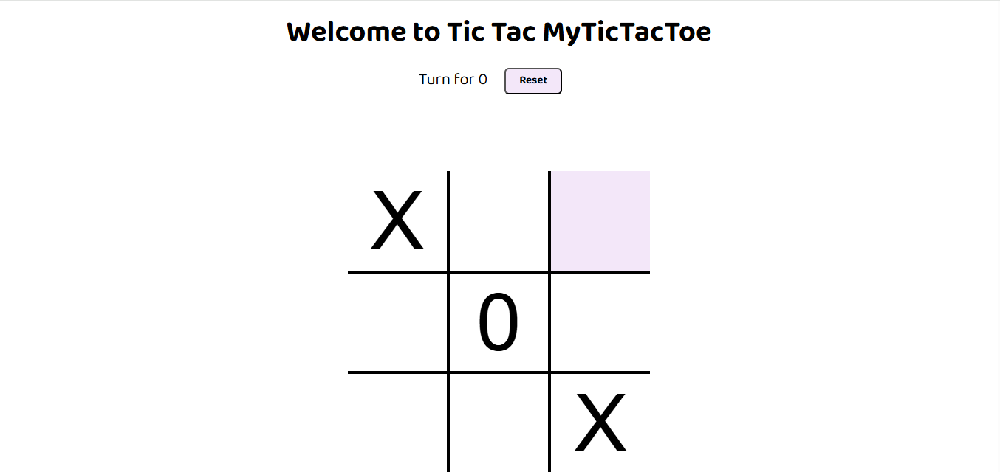
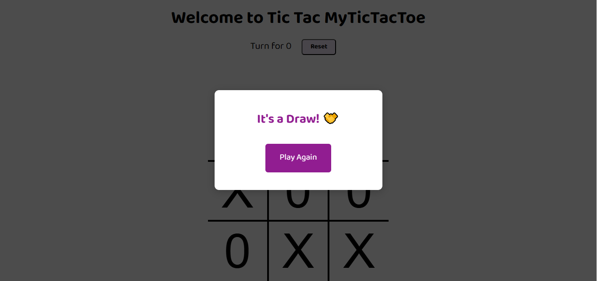
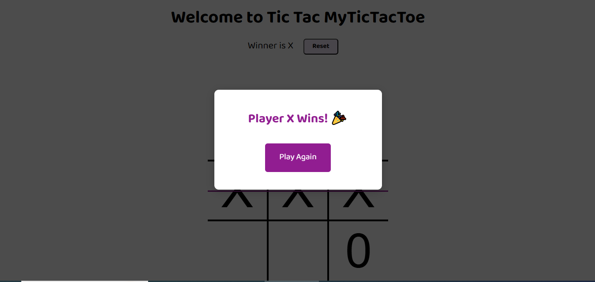

# Tic-Tac-Toe Game

This is a web-based Tic-Tac-Toe game built using HTML, CSS, and JavaScript.

## Features

- Interactive 3x3 grid for two players (X and O)
- Turn indicator and winner/draw detection
- Animated winning line and modal popup for game results
- Sound effects for moves, wins, and game over
- Reset and play again functionality

## How It Works

- Players take turns clicking on empty boxes to place their symbol (X or O).
- The game checks for a winner after each move and displays a modal if someone wins or if the game is a draw.
- Sound effects play for moves, wins, and game end.
- The board can be reset at any time using the "Reset" button or "Play Again" in the modal.

## Files

- `index.html`: Main HTML structure for the game.
- `style.css`: Styles for layout, animations, and modal.
- `script.js`: Game logic, event handling, and sound effects.
- `ting.mp3`, `gameover.mp3`, `music.mp3`: Sound files for game events.

## Getting Started

1. Open `index.html` in your browser.
2. Play Tic-Tac-Toe with a friend!
3. Use the "Reset" button or "Play Again" to start a new game.

## Credits

Developed as a guided project for learning JavaScript, HTML, and CSS.